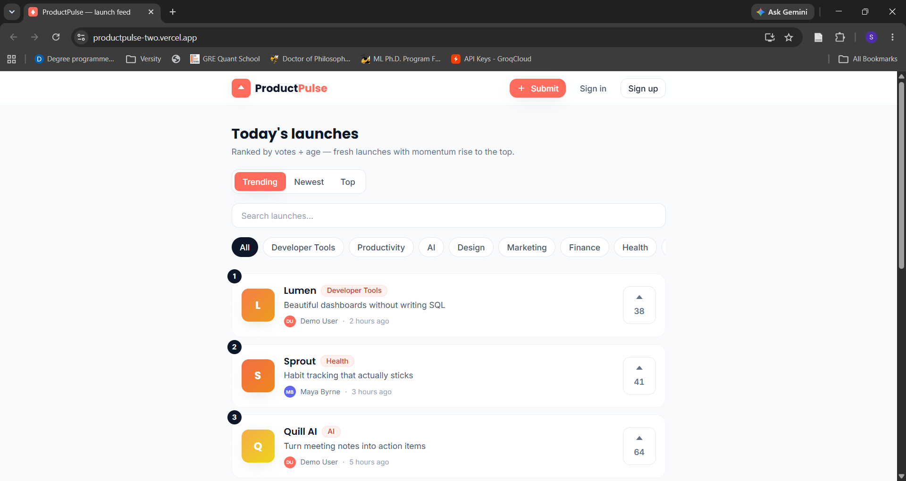
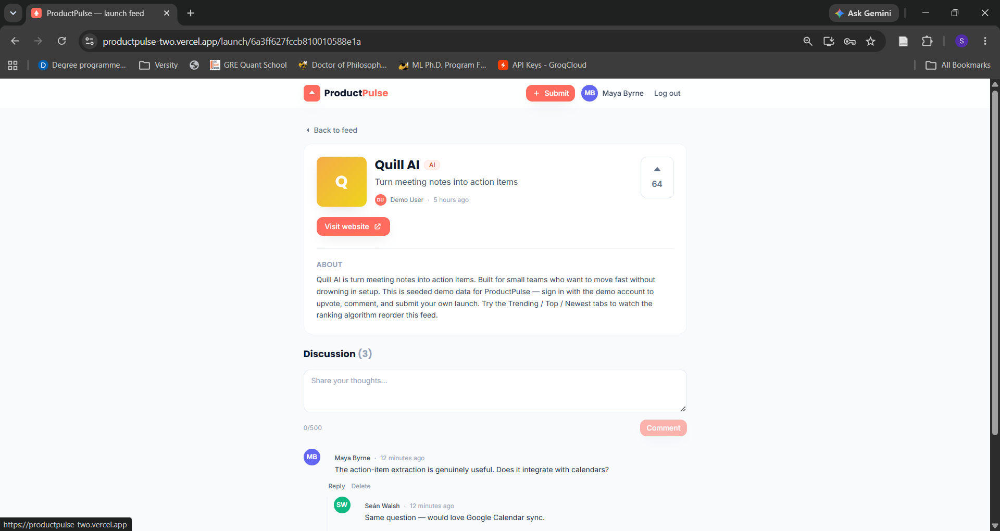
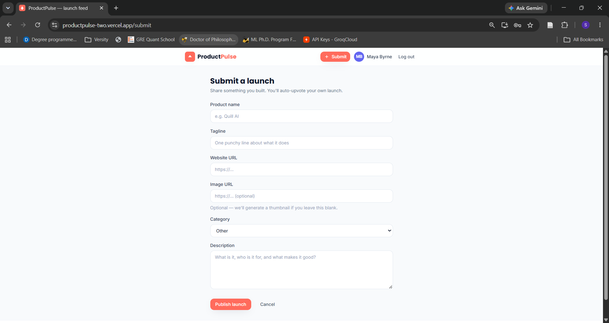
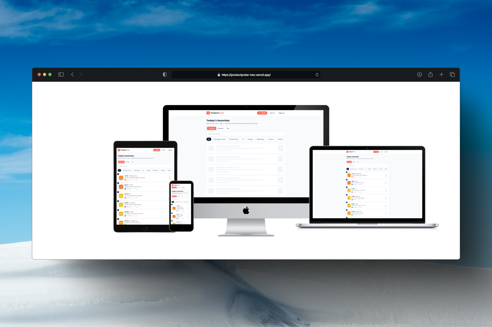

# ProductPulse 🚀

A Product Hunt–style launch feed built on the **MERN stack** (MongoDB · Express · React · Node). Users submit products, upvote the ones they like, and discuss them in threaded comments. The feed ranks launches with a **time-decayed "hot" algorithm** so fresh launches with momentum rise above older, higher-vote ones.

This is app **#1** of a 12-app MERN portfolio. App accent: **Coral** `#FF6B5C`.

---

## ✨ Features

- **Ranked feed** with three views: **Trending** (votes ÷ age), **Newest**, and **Top** (all-time votes).
- **Upvoting with optimistic UI** — the button flips instantly, then reconciles with the server (and rolls back on failure).
- **Threaded comments** (replies nested to any depth) on every launch.
- **JWT auth** — register / sign in to submit, upvote, and comment. Browsing is public.
- **Submit form** with client-side (react-hook-form) **and** server-side (express-validator) validation.
- **Search** and **category filtering**.
- Loading / empty / error states on every async view; skeleton loaders; toasts.
- Mobile-first responsive layout with accessibility basics (semantic HTML, labels, focus states, reduced-motion support).

---

## 🧠 The engineering lesson

The heart of this app is the **ranking algorithm** in [`server/src/services/ranking.js`](server/src/services/ranking.js). It uses a Hacker-News-style decay:

```
score = votes / (ageHours + 2) ^ gravity      // gravity = 1.8
```

This means a launch with 38 votes posted 2 hours ago can outrank one with 240 votes from 4 days ago — recency is rewarded, so the front page stays fresh. Ranking is computed in JavaScript after fetching the filtered set, then paginated, which is the right trade-off at portfolio scale (at real scale you'd precompute scores or use an aggregation pipeline).

The second lesson is the **optimistic UI** in [`client/src/hooks/useVote.js`](client/src/hooks/useVote.js): snapshot → flip immediately → await server → reconcile or roll back.

---

## 🧱 Tech stack & versions

Pinned to the **2021–2022** MERN era.

**Frontend** (`client/`)
| Package | Version |
|---|---|
| react / react-dom | 17.0.2 |
| react-router-dom | ^6.3 |
| axios | 0.27.2 |
| react-hook-form | ^7.34 |
| react-toastify | ^9.0 |
| dayjs | ^1.11 |
| tailwindcss | ^3.1 |
| react-scripts (CRA) | 5.0.1 |

**Backend** (`server/`)
| Package | Version |
|---|---|
| express | 4.18.1 |
| mongoose | ^6.5 |
| jsonwebtoken | 8.5.1 |
| bcryptjs | 2.4.3 |
| express-validator | ^6.14 |
| helmet | ^6.0 |
| express-rate-limit | ^6.7 |
| cors | 2.8.5 |
| morgan | ^1.10 |
| dotenv | ^16.0 |

**Runtime:** Node **16.x** (engines `>=16 <17`), npm 8.x.

---

## 📁 Structure

```
productpulse/
├── client/                 # React (CRA) + Tailwind
│   └── src/
│       ├── api/            # axios instance + endpoint functions
│       ├── components/     # shared UI kit + feature components
│       ├── context/        # AuthContext
│       ├── hooks/          # useAuth, useVote
│       ├── pages/          # route-level views
│       └── utils/
├── server/                 # Express + Mongoose
│   └── src/
│       ├── config/         # db.js
│       ├── controllers/
│       ├── middleware/     # auth, errorHandler, notFound
│       ├── models/         # User, Product, Comment
│       ├── routes/
│       ├── services/       # ranking.js  ← the lesson
│       ├── utils/          # asyncHandler, apiResponse, generateToken
│       ├── seed.js
│       └── server.js
└── package.json            # root: runs both with concurrently
```

---

## 🚀 Getting started

### Prerequisites
- Node 16.x and npm 8.x
- A MongoDB instance — local (`mongodb://localhost:27017`) or a free MongoDB Atlas cluster.

### 1. Install dependencies (root + both apps)

```bash
npm run install-all
```

> Or manually: `npm install` in the root, then in `client/`, then in `server/`.

### 2. Configure environment variables

Copy both example files and fill them in:

```bash
cp server/.env.example server/.env
cp client/.env.example client/.env
```

`server/.env`
```
PORT=5000
MONGO_URI=mongodb://localhost:27017/productpulse
JWT_SECRET=change_me_to_a_long_random_string
JWT_EXPIRES_IN=7d
CLIENT_URL=http://localhost:3000
```

`client/.env`
```
REACT_APP_API_URL=http://localhost:5000/api
```

### 3. Seed the database (optional but recommended)

Loads 3 demo users and 12 launches with staggered ages so the Trending ranking is immediately visible:

```bash
npm run seed
```

**Demo login:** `demo@productpulse.dev` · password `password123`
(also `maya@productpulse.dev` and `sean@productpulse.dev`, same password)

### 4. Run both apps with one command

```bash
npm run dev
```

- Client → http://localhost:3000
- API → http://localhost:5000/api  (health check: `/api/health`)

`concurrently` runs the Express server (via `nodemon`) and the CRA dev server together.

---

## 🔌 API reference

All responses use one envelope: `{ success, data, message? }` on success, `{ success, message, errors:[] }` on failure.

| Method | Endpoint | Auth | Description |
|---|---|---|---|
| POST | `/api/auth/register` | — | Create account → `{ token, user }` |
| POST | `/api/auth/login` | — | Sign in → `{ token, user }` |
| GET | `/api/auth/me` | ✅ | Current user |
| GET | `/api/products` | optional | Feed (`?sort=trending\|newest\|top&page&limit&category&q`) |
| GET | `/api/products/:id` | optional | Single launch |
| POST | `/api/products` | ✅ | Submit a launch |
| POST | `/api/products/:id/upvote` | ✅ | Toggle your upvote |
| DELETE | `/api/products/:id` | ✅ owner | Delete your launch |
| GET | `/api/comments/product/:productId` | — | Nested comment tree |
| POST | `/api/comments/product/:productId` | ✅ | Add comment / reply |
| DELETE | `/api/comments/:id` | ✅ author | Delete comment |

Send the token as `Authorization: Bearer <token>`.

---

## 🔐 Security notes

- Passwords are hashed with **bcryptjs** and never returned in any response.
- Keyed third-party APIs aren't used here (the feed is our own seeded data), but the pattern across the portfolio is: **all secrets live only in `server/.env`** and are never exposed to the client.
- The JWT is stored in **localStorage** via `AuthContext` for portfolio simplicity. In production, an **httpOnly, Secure cookie** is the safer choice — it keeps the token out of reach of XSS-injected JavaScript. This trade-off is flagged in the code.
- `helmet`, `cors` (locked to `CLIENT_URL`), and `express-rate-limit` (300 req / 15 min on `/api`) are enabled.

---

## ✅ Definition of Done

- [x] One command boots client + server (`npm run dev`).
- [x] `.env.example` in client **and** server; real `.env` git-ignored.
- [x] Responsive + accessibility basics.
- [x] Loading / empty / error states on every async view.
- [x] Shared design system + Coral accent.
- [x] Forms validated client **and** server.
- [x] Auth + protected routes; no passwords leaked.
- [x] Ranking algorithm + optimistic UI.
- [ ] Screenshots (add yours below).
- [ ] Deploy (client → Netlify/Vercel, server → Render/Railway, DB → Atlas).

---

## 📸 Screenshots

_Add screenshots here once running:_

**The Ranked Feed:**


**Launch Detail & Comments:**


**Submit Form:**


**Submit Form:**

---

Built as a learning + showcase project. MIT-style use; do what you like with it.
